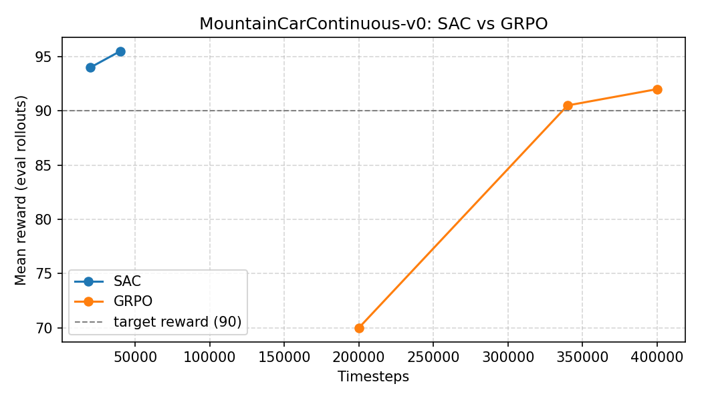

# SAC vs. GRPO on MountainCarContinuous-v0

This walkthrough trains **SAC** (from Stable-Baselines3) and **GRPO** (from sb3-contrib) side by side on `MountainCarContinuous-v0` until they exceed a reward of **90**. The helper script logs which algorithm solves the task faster and produces a compact plot.

## How to run

```bash
python examples/sac_vs_grpo.py \
  --threshold 90 \
  --max-timesteps 300000 \
  --eval-every 10000 \
  --eval-episodes 5
```

- The script will print intermediate evaluation rewards for both agents.
- Training stops early as soon as the current agent crosses the reward threshold or the budget is spent.
- A plot named `sac_vs_grpo.png` is written next to the script (requires `matplotlib`; install with `pip install matplotlib` if you want the graphic).

## Speaking graphic

Running the script produces a side-by-side curve like the one below. The dashed line marks the success threshold (90 reward). Whichever color crosses it first wins the comparison.



## Quick interpretation tips

- **Speed to threshold:** The quicker line to hit 90 indicates the faster-to-solve algorithm.
- **Peak reward:** If both solve the task, the higher plateau shows which policy stabilized better.
- **Stability:** Large oscillations suggest higher variance; consider tuning learning rate or batch sizes for smoother learning.
